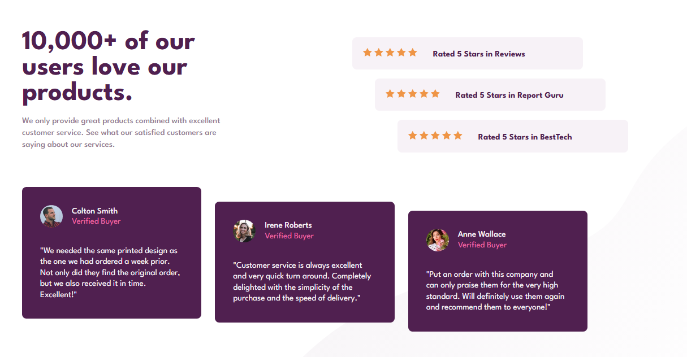
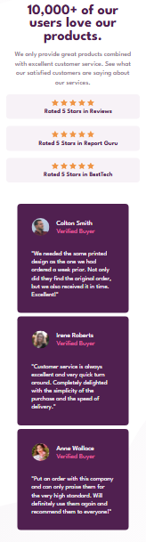

# Social Proof Section - Frontend Mentor Challenge

Este projeto é uma solução para o desafio [Social Proof Section](https://www.frontendmentor.io/challenges/social-proof-section-6e0qTv_bA) do Frontend Mentor. O objetivo era criar uma seção de avaliações de clientes com design responsivo, seguindo um layout fornecido.

## 🚀 Visão Geral

O projeto consiste em uma página que exibe:
- Um título e uma descrição destacando a qualidade dos produtos e serviços.
- Uma seção de avaliações com estrelas e comentários de clientes.
- Cards com depoimentos de clientes verificados.

O layout foi desenvolvido para ser totalmente responsivo, adaptando-se a diferentes tamanhos de tela, desde desktops até dispositivos móveis.

## 🛠️ Tecnologias Utilizadas

- **HTML5**: Estrutura semântica do conteúdo.
- **CSS3**: Estilização e layout responsivo.
  - Flexbox e Grid para organização do layout.
  - Variáveis CSS para gerenciamento de cores.
  - Media Queries para responsividade.
- **Git e GitHub**: Controle de versão e hospedagem do projeto.

## 🎨 Design

O design foi baseado no layout fornecido pelo Frontend Mentor, com as seguintes características:
- Cores primárias: `hsl(300, 43%, 22%)` e `hsl(333, 80%, 67%)`.
- Fontes: `League Spartan` (Google Fonts).
- Imagens de fundo para adicionar detalhes visuais.

## 📱 Responsividade

O projeto foi desenvolvido com foco em responsividade, utilizando:
- `flexbox` e `grid` para layouts flexíveis.
- `media queries` para ajustar o design em telas menores.
- Unidades relativas (`rem`, `%`) para garantir escalabilidade.

## 📂 Estrutura do Projeto
